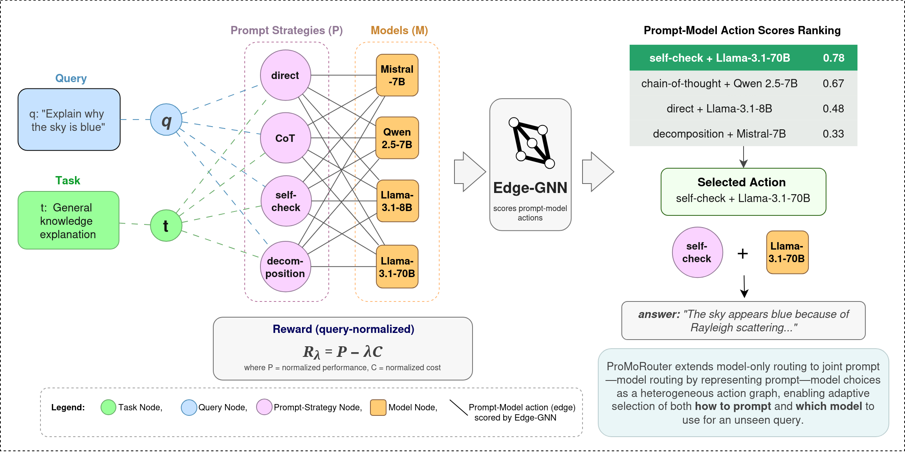

# ProMoRouter

This repository contains the implementation and experimental artifacts for **ProMoRouter**, a heterogeneous graph-based router for joint prompt--model selection. ProMoRouter treats prompting strategy as a first-class routing decision: for each input query, it selects both a prompting strategy and an LLM from a candidate pool under a deployment objective that trades off performance and cost.

This repository accompanies an anonymous ACL submission. Author information, project webpages, citation metadata, and other identifying information have been removed for double-blind review and will be restored after the review process.

## Overview

ProMoRouter formulates routing as edge-aware decision making over a heterogeneous interaction graph with task, query, prompt, and model nodes. During training, observed query--prompt--model interactions define action edges. At inference time, the router scores candidate prompt--model actions and selects the highest-scoring pair for each query.

The main experimental setting evaluates three deployment regimes using a query-normalized reward:

- **Performance-first**: low cost penalty, `lambda = 0.1`
- **Balanced**: moderate cost penalty, `lambda = 0.5`
- **Cost-first**: high cost penalty, `lambda = 0.9`

The repository also includes static and adaptive baselines, including fixed-model, fixed-pair, model-only routing, and oracle upper bounds.

## Method Overview

<p align="center">
  
</p>

**Figure 1.** Overview of ProMoRouter. Queries are embedded into a heterogeneous graph containing task, prompt, and model nodes. The router scores candidate prompt--model actions and selects the highest-scoring action for inference.

## Repository Structure

```text
.
├── data/
│   ├── interaction_logs/
│   │   └── interaction_logs_v1/
│   │       └── router_bipartite_qnorm.jsonl
│   └── router/
│       ├── query_embeddings.pt
│       ├── task_embeddings.pt
│       ├── prompt_embeddings.pt
│       ├── model_embeddings.pt
│       └── node_description_embedding_metadata.json
├── scripts/
│   ├── build_node_description_embeddings.py
│   └── summarize_results.py
├── outputs/
├── train_router_edgegnn_qnorm.py
├── train_router_model_only_direct_qnorm.py
├── train_router_fixed_baselines_qnorm.py
└── README.md
```

Some generated files may be absent from the anonymized archive and can be reproduced with the commands below.

## Environment

Create and activate a Python environment:

```bash
python -m venv .venv
source .venv/bin/activate
pip install --upgrade pip
```

Install the required packages:

```bash
pip install torch numpy pandas scikit-learn tqdm sentence-transformers
```

If your local setup uses CUDA-specific PyTorch wheels, install PyTorch following the instructions for your CUDA version before installing the remaining dependencies.

## Data Preparation

The main router data is expected at:

```text
data/interaction_logs/interaction_logs_v1/router_bipartite_qnorm.jsonl
```

The expected embedding files are:

```text
data/router/query_embeddings.pt
data/router/task_embeddings.pt
data/router/prompt_embeddings.pt
data/router/model_embeddings.pt
```

If node-description embeddings are missing, regenerate them with:

```bash
python scripts/build_node_description_embeddings.py
```

## Running the Main Method

Run ProMoRouter Edge-GNN for one seed:

```bash
python train_router_edgegnn_qnorm.py --seed 1
```

Run the five seeds used in the paper:

```bash
python train_router_edgegnn_qnorm.py --seed 1
python train_router_edgegnn_qnorm.py --seed 2
python train_router_edgegnn_qnorm.py --seed 3
python train_router_edgegnn_qnorm.py --seed 4
python train_router_edgegnn_qnorm.py --seed 5
```

To select a GPU explicitly:

```bash
CUDA_VISIBLE_DEVICES=0 python train_router_edgegnn_qnorm.py --seed 1
```

The script trains and evaluates the router for all three reward regimes:

```text
reward_qnorm_lam_01
reward_qnorm_lam_05
reward_qnorm_lam_09
```

Outputs are written to:

```text
outputs/router_edgegnn_qnorm/
```

## Running Baselines

### Static baselines

Run each static baseline evaluation with the same seed used by the learned
routers. All methods automatically reuse
`data/router/splits/qnorm_seed<seed>.json`.

```bash
python analysis/evaluate_qnorm_baselines_on_test.py --seed 1
```

This evaluates:

- Largest LLM
- Smallest LLM
- Best Fixed Model
- Best Fixed Prompt--Model Pair
- Oracle Model-Only
- Oracle Prompt--Model

### Model-only routing baseline

```bash
python train_router_model_only_direct_qnorm.py --seed 1
python train_router_model_only_direct_qnorm.py --seed 2
python train_router_model_only_direct_qnorm.py --seed 3
python train_router_model_only_direct_qnorm.py --seed 4
python train_router_model_only_direct_qnorm.py --seed 5
```

This baseline routes only over models and does not explicitly select prompting
strategies. Its scorer uses only query and model embeddings; realized
performance, token usage, monetary cost, and normalized cost remain evaluation
labels and are not routing-time inputs.

## Optional Ablations

If included in the archive, the following scripts reproduce graph-structure and neighborhood-size ablations:

```bash
python train_router_edgegnn_qnorm.py --seed 1
python train_router_edgegnn_qnorm_lattice.py --seed 1
python train_router_edgegnn_qnorm_topk5.py --seed 1
python train_router_edgegnn_qnorm_topk5_lattice.py --seed 1
```

Run each command for seeds 1--5 to reproduce the multi-seed summaries.

## Summarizing Results

After running all seeds, summarize results with:

```bash
python scripts/summarize_results.py
```

If the summarization script is not included, the result files can be inspected directly. Each run produces JSON files of the form:

```text
outputs/<experiment_name>/<experiment_name>_results_seed<N>.json
```

Each JSON file reports performance `P`, normalized cost `C`, reward `R`, selected prompt counts, and selected model counts for each reward regime.

## Main Metrics

The reported metrics are:

- `P`: normalized task performance
- `C`: normalized query-level inference cost
- `R`: deployment reward

The reward follows the query-normalized cost setting used in the experiments:

```text
R = P - lambda * C
```

where `lambda` controls the strength of the cost penalty.

## Routing-integrity validation

Before training or reporting results, validate reward algebra and action-space
coverage:

```bash
python analysis/validate_qnorm_pipeline.py
```

The command fails if a stored reward differs from
`performance - lambda * cost_norm_query`, if normalized costs fall outside
`[0, 1]`, or if a query does not contain the expected 4 x 9 action space.
Use `--allow-incomplete` only for explicitly incomplete diagnostic datasets.

If the source contains partial queries, preserve it and create a complete-only
copy:

```bash
python analysis/filter_complete_qnorm_queries.py
python analysis/validate_qnorm_pipeline.py \
  --data data/interaction_logs/grpp_il_v1/router_bipartite_qnorm_complete.jsonl \
  --expected-queries-per-task 0
```

Train the Edge-GNN on that explicit input:

```bash
python train_router_edgegnn_qnorm.py \
  --data-path data/interaction_logs/grpp_il_v1/router_bipartite_qnorm_complete.jsonl \
  --seed 1
```

The trainer independently enforces complete, unique action spaces and stops
before optimization if the contract is violated.

## Reproducibility Notes

The experiments are stochastic and should be reported over multiple seeds.
For a given seed, the Edge-GNN, GraphRouter-direct, and static baselines reuse
the same persisted train/validation/test manifest. Do not compare results
produced from different split manifests. For the main table, use the mean over seeds. Standard deviations can be reported in an appendix or ablation table when available.

Recommended reporting format:

```text
mean ± standard deviation
```

For the compact main paper table, use three decimal places.

## Citation

This repository is anonymized for review. Citation information will be added after the review process.

## License

License information will be added in the public release.
